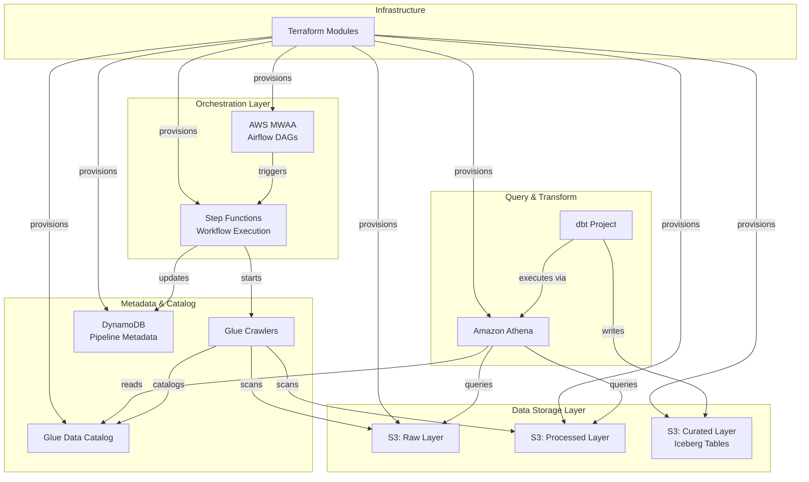
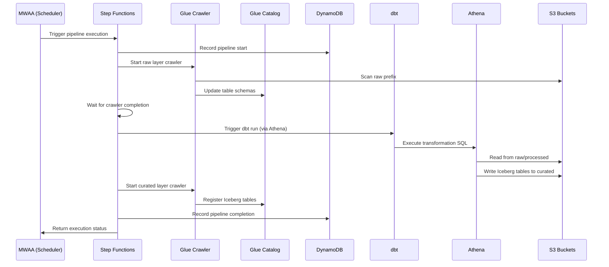

# Design Document: AWS Data Lakehouse MVP

## Overview

This design describes an AWS Data Lakehouse MVP that demonstrates the modern lakehouse pattern using serverless and managed AWS services. The architecture follows a two-tier orchestration model where AWS MWAA handles high-level pipeline scheduling and dependencies, while Step Functions manages granular workflow execution with native AWS service integrations.

The data flows through three logical layers in S3: raw (landing zone), processed (cleaned/validated), and curated (business-ready Iceberg tables). dbt with the Athena adapter manages transformations and creates Iceberg tables for ACID-compliant analytics.

## Architecture



### Data Flow Sequence



## Components and Interfaces

### 1. Terraform Module Structure

```
terraform/
├── main.tf                 # Root module, provider config
├── variables.tf            # Input variables
├── outputs.tf              # Output values
├── backend.tf              # Remote state configuration
├── modules/
│   ├── storage/
│   │   ├── main.tf         # S3 buckets, lifecycle policies
│   │   ├── variables.tf
│   │   └── outputs.tf
│   ├── catalog/
│   │   ├── main.tf         # Glue database, crawlers
│   │   ├── variables.tf
│   │   └── outputs.tf
│   ├── metadata/
│   │   ├── main.tf         # DynamoDB table
│   │   ├── variables.tf
│   │   └── outputs.tf
│   ├── orchestration/
│   │   ├── main.tf         # MWAA environment
│   │   ├── variables.tf
│   │   └── outputs.tf
│   ├── workflow/
│   │   ├── main.tf         # Step Functions
│   │   ├── state_machine.json
│   │   ├── variables.tf
│   │   └── outputs.tf
│   └── analytics/
│       ├── main.tf         # Athena workgroup
│       ├── variables.tf
│       └── outputs.tf
└── environments/
    └── sandbox/
        └── terraform.tfvars
```

### 2. S3 Storage Module Interface

```hcl
# modules/storage/variables.tf
variable "environment" {
  type        = string
  description = "Environment name (e.g., sandbox, dev, prod)"
}

variable "project_name" {
  type        = string
  description = "Project identifier for resource naming"
}

variable "kms_key_arn" {
  type        = string
  description = "KMS key ARN for S3 encryption"
  default     = null  # Uses aws/s3 if not provided
}

# modules/storage/outputs.tf
output "data_lake_bucket_name" {
  value = aws_s3_bucket.data_lake.id
}

output "data_lake_bucket_arn" {
  value = aws_s3_bucket.data_lake.arn
}

output "raw_prefix" {
  value = "raw/"
}

output "processed_prefix" {
  value = "processed/"
}

output "curated_prefix" {
  value = "curated/"
}

output "dags_bucket_name" {
  value = aws_s3_bucket.mwaa_dags.id
}
```

### 3. Glue Catalog Module Interface

```hcl
# modules/catalog/variables.tf
variable "environment" {
  type = string
}

variable "project_name" {
  type = string
}

variable "data_lake_bucket_name" {
  type        = string
  description = "S3 bucket containing data lake"
}

variable "crawler_schedule" {
  type        = string
  description = "Cron expression for crawler schedule"
  default     = "cron(0 */6 * * ? *)"  # Every 6 hours
}

# modules/catalog/outputs.tf
output "glue_database_name" {
  value = aws_glue_catalog_database.lakehouse.name
}

output "raw_crawler_name" {
  value = aws_glue_crawler.raw.name
}

output "processed_crawler_name" {
  value = aws_glue_crawler.processed.name
}

output "curated_crawler_name" {
  value = aws_glue_crawler.curated.name
}

output "crawler_role_arn" {
  value = aws_iam_role.glue_crawler.arn
}
```

### 4. DynamoDB Metadata Module Interface

```hcl
# modules/metadata/variables.tf
variable "environment" {
  type = string
}

variable "project_name" {
  type = string
}

variable "billing_mode" {
  type        = string
  description = "DynamoDB billing mode"
  default     = "PAY_PER_REQUEST"  # Serverless
}

# modules/metadata/outputs.tf
output "table_name" {
  value = aws_dynamodb_table.pipeline_metadata.name
}

output "table_arn" {
  value = aws_dynamodb_table.pipeline_metadata.arn
}
```

### 5. Step Functions Module Interface

```hcl
# modules/workflow/variables.tf
variable "environment" {
  type = string
}

variable "project_name" {
  type = string
}

variable "glue_database_name" {
  type = string
}

variable "raw_crawler_name" {
  type = string
}

variable "curated_crawler_name" {
  type = string
}

variable "metadata_table_name" {
  type = string
}

variable "athena_workgroup" {
  type = string
}

# modules/workflow/outputs.tf
output "state_machine_arn" {
  value = aws_sfn_state_machine.data_pipeline.arn
}

output "state_machine_name" {
  value = aws_sfn_state_machine.data_pipeline.name
}
```

### 6. MWAA Orchestration Module Interface

```hcl
# modules/orchestration/variables.tf
variable "environment" {
  type = string
}

variable "project_name" {
  type = string
}

variable "dags_bucket_name" {
  type = string
}

variable "vpc_id" {
  type = string
}

variable "private_subnet_ids" {
  type = list(string)
}

variable "state_machine_arn" {
  type        = string
  description = "Step Functions state machine ARN to invoke"
}

variable "environment_class" {
  type        = string
  description = "MWAA environment class"
  default     = "mw1.small"
}

# modules/orchestration/outputs.tf
output "mwaa_environment_name" {
  value = aws_mwaa_environment.main.name
}

output "mwaa_webserver_url" {
  value = aws_mwaa_environment.main.webserver_url
}

output "mwaa_execution_role_arn" {
  value = aws_iam_role.mwaa_execution.arn
}
```

### 7. Athena Analytics Module Interface

```hcl
# modules/analytics/variables.tf
variable "environment" {
  type = string
}

variable "project_name" {
  type = string
}

variable "query_results_bucket" {
  type        = string
  description = "S3 bucket for Athena query results"
}

variable "glue_database_name" {
  type = string
}

variable "bytes_scanned_cutoff" {
  type        = number
  description = "Maximum bytes scanned per query"
  default     = 10737418240  # 10 GB
}

# modules/analytics/outputs.tf
output "workgroup_name" {
  value = aws_athena_workgroup.main.name
}

output "workgroup_arn" {
  value = aws_athena_workgroup.main.arn
}
```

## Data Models

### DynamoDB Pipeline Metadata Schema

```
Table: {project}-{env}-pipeline-metadata

Partition Key: pipeline_name (String)
Sort Key: execution_date (String, ISO 8601 format)

Attributes:
- pipeline_name: String (PK) - Name of the pipeline (e.g., "raw_to_curated")
- execution_date: String (SK) - Execution date in YYYY-MM-DD format
- execution_id: String - Unique execution identifier (Step Functions execution ARN)
- status: String - Pipeline status (RUNNING, SUCCEEDED, FAILED, TIMED_OUT)
- start_time: String - ISO 8601 timestamp
- end_time: String - ISO 8601 timestamp (null if running)
- duration_seconds: Number - Execution duration
- records_processed: Number - Count of records processed
- error_message: String - Error details if failed
- triggered_by: String - What triggered the run (scheduled, manual, event)
- metadata: Map - Additional key-value metadata

GSI: status-index
- Partition Key: status
- Sort Key: start_time
- Purpose: Query pipelines by status for monitoring
```

### Glue Catalog Structure

```
Database: {project}_{env}_lakehouse

Tables (auto-discovered by crawlers):
├── raw_*           # Tables from raw/ prefix
├── processed_*     # Tables from processed/ prefix  
└── curated_*       # Iceberg tables from curated/ prefix

Iceberg Table Properties (set by dbt):
- table_type: ICEBERG
- format: parquet
- write_compression: snappy
- partition_spec: varies by table
```

### dbt Project Structure

```
dbt_project/
├── dbt_project.yml
├── profiles.yml.example
├── packages.yml
├── models/
│   ├── staging/
│   │   ├── _staging__models.yml
│   │   ├── stg_raw_events.sql
│   │   └── stg_raw_users.sql
│   ├── intermediate/
│   │   ├── _intermediate__models.yml
│   │   └── int_events_enriched.sql
│   └── marts/
│       ├── _marts__models.yml
│       ├── dim_users.sql
│       └── fct_events.sql
├── macros/
│   └── iceberg_config.sql
├── tests/
│   └── generic/
└── seeds/
```

### dbt Model Configuration for Iceberg

```yaml
# dbt_project.yml
name: 'lakehouse_mvp'
version: '1.0.0'

profile: 'lakehouse'

model-paths: ["models"]
test-paths: ["tests"]
seed-paths: ["seeds"]
macro-paths: ["macros"]

models:
  lakehouse_mvp:
    staging:
      +materialized: view
      +schema: staging
    intermediate:
      +materialized: ephemeral
    marts:
      +materialized: table
      +schema: curated
      +table_type: iceberg
      +format: parquet
      +write_compression: snappy
```

### Sample dbt Iceberg Model

```sql
-- models/marts/fct_events.sql
{{
  config(
    materialized='table',
    table_type='iceberg',
    format='parquet',
    write_compression='snappy',
    partitioned_by=['date(event_date)'],
    s3_data_dir='s3://' ~ var('data_lake_bucket') ~ '/curated/fct_events/'
  )
}}

SELECT
    event_id,
    user_id,
    event_type,
    event_timestamp,
    DATE(event_timestamp) as event_date,
    event_properties,
    created_at
FROM {{ ref('int_events_enriched') }}
```

### Step Functions State Machine Definition

```json
{
  "Comment": "Data Lakehouse Pipeline - Crawl, Transform, Catalog",
  "StartAt": "RecordPipelineStart",
  "States": {
    "RecordPipelineStart": {
      "Type": "Task",
      "Resource": "arn:aws:states:::dynamodb:putItem",
      "Parameters": {
        "TableName": "${MetadataTableName}",
        "Item": {
          "pipeline_name": {"S": "raw_to_curated"},
          "execution_date": {"S.$": "$$.Execution.StartTime"},
          "execution_id": {"S.$": "$$.Execution.Id"},
          "status": {"S": "RUNNING"},
          "start_time": {"S.$": "$$.Execution.StartTime"},
          "triggered_by": {"S.$": "$.triggered_by"}
        }
      },
      "Next": "StartRawCrawler",
      "ResultPath": null
    },
    "StartRawCrawler": {
      "Type": "Task",
      "Resource": "arn:aws:states:::aws-sdk:glue:startCrawler",
      "Parameters": {
        "Name": "${RawCrawlerName}"
      },
      "Next": "WaitForRawCrawler",
      "Retry": [
        {
          "ErrorEquals": ["Glue.CrawlerRunningException"],
          "IntervalSeconds": 60,
          "MaxAttempts": 5,
          "BackoffRate": 1.0
        }
      ],
      "Catch": [
        {
          "ErrorEquals": ["States.ALL"],
          "Next": "RecordPipelineFailure"
        }
      ]
    },
    "WaitForRawCrawler": {
      "Type": "Wait",
      "Seconds": 30,
      "Next": "CheckRawCrawlerStatus"
    },
    "CheckRawCrawlerStatus": {
      "Type": "Task",
      "Resource": "arn:aws:states:::aws-sdk:glue:getCrawler",
      "Parameters": {
        "Name": "${RawCrawlerName}"
      },
      "Next": "IsRawCrawlerComplete",
      "ResultPath": "$.crawlerStatus"
    },
    "IsRawCrawlerComplete": {
      "Type": "Choice",
      "Choices": [
        {
          "Variable": "$.crawlerStatus.Crawler.State",
          "StringEquals": "READY",
          "Next": "RunDbtTransformations"
        }
      ],
      "Default": "WaitForRawCrawler"
    },
    "RunDbtTransformations": {
      "Type": "Task",
      "Resource": "arn:aws:states:::athena:startQueryExecution.sync",
      "Parameters": {
        "QueryString": "-- dbt run placeholder - actual implementation uses dbt CLI",
        "WorkGroup": "${AthenaWorkgroup}",
        "QueryExecutionContext": {
          "Database": "${GlueDatabaseName}"
        }
      },
      "Next": "StartCuratedCrawler",
      "Catch": [
        {
          "ErrorEquals": ["States.ALL"],
          "Next": "RecordPipelineFailure"
        }
      ]
    },
    "StartCuratedCrawler": {
      "Type": "Task",
      "Resource": "arn:aws:states:::aws-sdk:glue:startCrawler",
      "Parameters": {
        "Name": "${CuratedCrawlerName}"
      },
      "Next": "WaitForCuratedCrawler",
      "Retry": [
        {
          "ErrorEquals": ["Glue.CrawlerRunningException"],
          "IntervalSeconds": 60,
          "MaxAttempts": 5,
          "BackoffRate": 1.0
        }
      ],
      "Catch": [
        {
          "ErrorEquals": ["States.ALL"],
          "Next": "RecordPipelineFailure"
        }
      ]
    },
    "WaitForCuratedCrawler": {
      "Type": "Wait",
      "Seconds": 30,
      "Next": "CheckCuratedCrawlerStatus"
    },
    "CheckCuratedCrawlerStatus": {
      "Type": "Task",
      "Resource": "arn:aws:states:::aws-sdk:glue:getCrawler",
      "Parameters": {
        "Name": "${CuratedCrawlerName}"
      },
      "Next": "IsCuratedCrawlerComplete",
      "ResultPath": "$.crawlerStatus"
    },
    "IsCuratedCrawlerComplete": {
      "Type": "Choice",
      "Choices": [
        {
          "Variable": "$.crawlerStatus.Crawler.State",
          "StringEquals": "READY",
          "Next": "RecordPipelineSuccess"
        }
      ],
      "Default": "WaitForCuratedCrawler"
    },
    "RecordPipelineSuccess": {
      "Type": "Task",
      "Resource": "arn:aws:states:::dynamodb:updateItem",
      "Parameters": {
        "TableName": "${MetadataTableName}",
        "Key": {
          "pipeline_name": {"S": "raw_to_curated"},
          "execution_date": {"S.$": "$$.Execution.StartTime"}
        },
        "UpdateExpression": "SET #status = :status, end_time = :end_time",
        "ExpressionAttributeNames": {
          "#status": "status"
        },
        "ExpressionAttributeValues": {
          ":status": {"S": "SUCCEEDED"},
          ":end_time": {"S.$": "$$.State.EnteredTime"}
        }
      },
      "End": true
    },
    "RecordPipelineFailure": {
      "Type": "Task",
      "Resource": "arn:aws:states:::dynamodb:updateItem",
      "Parameters": {
        "TableName": "${MetadataTableName}",
        "Key": {
          "pipeline_name": {"S": "raw_to_curated"},
          "execution_date": {"S.$": "$$.Execution.StartTime"}
        },
        "UpdateExpression": "SET #status = :status, end_time = :end_time, error_message = :error",
        "ExpressionAttributeNames": {
          "#status": "status"
        },
        "ExpressionAttributeValues": {
          ":status": {"S": "FAILED"},
          ":end_time": {"S.$": "$$.State.EnteredTime"},
          ":error": {"S.$": "$.Error"}
        }
      },
      "End": true
    }
  }
}
```

### Sample Airflow DAG

```python
# dags/lakehouse_pipeline.py
from datetime import datetime, timedelta
from airflow import DAG
from airflow.providers.amazon.aws.operators.step_function import StepFunctionStartExecutionOperator
from airflow.providers.amazon.aws.sensors.step_function import StepFunctionExecutionSensor

default_args = {
    'owner': 'data-engineering',
    'depends_on_past': False,
    'email_on_failure': True,
    'email_on_retry': False,
    'retries': 0,  # Step Functions handles retries
    'retry_delay': timedelta(minutes=5),
}

with DAG(
    dag_id='lakehouse_raw_to_curated',
    default_args=default_args,
    description='Orchestrate data lakehouse pipeline via Step Functions',
    schedule_interval='0 6 * * *',  # Daily at 6 AM UTC
    start_date=datetime(2024, 1, 1),
    catchup=False,
    tags=['lakehouse', 'production'],
) as dag:

    start_pipeline = StepFunctionStartExecutionOperator(
        task_id='start_pipeline',
        state_machine_arn='{{ var.value.lakehouse_state_machine_arn }}',
        input={
            'triggered_by': 'scheduled',
            'execution_date': '{{ ds }}'
        },
    )

    wait_for_completion = StepFunctionExecutionSensor(
        task_id='wait_for_completion',
        execution_arn="{{ task_instance.xcom_pull(task_ids='start_pipeline') }}",
        poke_interval=60,
        timeout=3600,  # 1 hour timeout
    )

    start_pipeline >> wait_for_completion
```


## Correctness Properties

*A property is a characteristic or behavior that should hold true across all valid executions of a system—essentially, a formal statement about what the system should do. Properties serve as the bridge between human-readable specifications and machine-verifiable correctness guarantees.*

### Property 1: Terraform Configuration Validity

*For any* Terraform module in this project, running `terraform validate` and `terraform plan` SHALL succeed without errors, and the plan output SHALL contain the expected resource types (aws_s3_bucket, aws_glue_crawler, aws_dynamodb_table, aws_sfn_state_machine, aws_mwaa_environment, aws_athena_workgroup).

**Validates: Requirements 1.1, 1.3, 1.4, 1.5, 2.1, 2.2, 2.4, 2.5, 3.1, 3.4, 3.5, 4.1, 4.2, 4.3, 5.1, 5.6, 6.1, 6.2, 8.1, 8.5, 8.6**

### Property 2: S3 Bucket Security Configuration

*For any* S3 bucket created by the storage module, the bucket configuration SHALL have versioning enabled, server-side encryption with KMS, public access blocked, and lifecycle rules defined.

**Validates: Requirements 1.1, 1.3, 1.4, 1.5**

### Property 3: DynamoDB Key Schema Correctness

*For any* DynamoDB table created by the metadata module, the key schema SHALL define pipeline_name as partition key (HASH) and execution_date as sort key (RANGE), enabling queries by pipeline and date.

**Validates: Requirements 3.1, 3.3**

### Property 4: IAM Policy Completeness

*For any* IAM policy created for service integration, the policy document SHALL contain all required actions for the service to function: MWAA policies include states:StartExecution and glue:StartCrawler; Step Functions policies include dynamodb:PutItem, dynamodb:UpdateItem, and glue:StartCrawler; Glue policies include s3:GetObject and glue catalog permissions.

**Validates: Requirements 9.1, 9.2, 9.3, 9.4**

### Property 5: Step Functions State Machine Structure

*For any* Step Functions state machine definition, the definition SHALL contain states for: recording pipeline start, starting crawler, waiting for crawler, running transformation, starting curated crawler, and recording completion/failure. Each task state SHALL include Retry and Catch configurations.

**Validates: Requirements 5.2, 5.3, 5.4, 5.5**

### Property 6: Airflow DAG Delegation Pattern

*For any* Airflow DAG in this project, the DAG SHALL use StepFunctionStartExecutionOperator to trigger workflows and StepFunctionExecutionSensor to monitor completion. The DAG SHALL have retries=0 in default_args, delegating retry logic to Step Functions.

**Validates: Requirements 4.4, 4.6, 4.7**

### Property 7: dbt Iceberg Model Configuration

*For any* dbt model in the marts layer, the model configuration SHALL specify table_type='iceberg', format='parquet', and s3_data_dir pointing to the curated prefix. Staging models SHALL be materialized as views.

**Validates: Requirements 7.1, 7.2, 7.5, 7.7**

### Property 8: Terraform Module Structure

*For any* Terraform module directory, the module SHALL contain main.tf, variables.tf, and outputs.tf files. The outputs SHALL export resource identifiers needed for cross-module integration.

**Validates: Requirements 8.2, 8.3, 8.4**

### Property 9: Resource Naming Consistency

*For any* AWS resource created by Terraform, the resource name SHALL follow the pattern `{project_name}-{environment}-{resource_type}` using variables defined in the root module.

**Validates: Requirements 9.6**

### Property 10: Glue Crawler Configuration

*For any* Glue crawler created by the catalog module, the crawler SHALL target the correct S3 prefix (raw, processed, or curated), have a schedule defined, and reference the lakehouse Glue database.

**Validates: Requirements 2.2, 2.5**

## Error Handling

### Terraform Error Handling

1. **State Locking**: Use S3 backend with DynamoDB for state locking to prevent concurrent modifications
2. **Validation**: Run `terraform validate` before `terraform plan` in CI/CD
3. **Plan Review**: Require plan output review before apply
4. **Rollback**: Use `terraform state` commands for manual rollback if needed

### Step Functions Error Handling

1. **Retry Policies**: Each task state includes retry configuration:
   - `CrawlerRunningException`: Wait and retry (crawler already running)
   - `ServiceException`: Exponential backoff retry
   - `States.Timeout`: Configurable timeout per state

2. **Catch Blocks**: All task states catch errors and route to `RecordPipelineFailure`

3. **Error Recording**: Failed executions update DynamoDB with error details

### Airflow Error Handling

1. **Sensor Timeout**: StepFunctionExecutionSensor has configurable timeout
2. **Failure Callbacks**: DAG can define `on_failure_callback` for alerting
3. **No Retries**: DAG retries=0 since Step Functions handles retries

### dbt Error Handling

1. **Schema Tests**: Fail fast on data quality issues
2. **Incremental Failures**: Use `on_schema_change='fail'` for breaking changes
3. **Logging**: dbt logs captured for debugging

### DynamoDB Error Handling

1. **Conditional Writes**: Use condition expressions to prevent duplicate entries
2. **Idempotency**: Pipeline metadata updates are idempotent (same execution_id)

## Testing Strategy

### Infrastructure Testing (Terraform)

**Unit Tests**: Use `terraform validate` and custom validation rules
- Validate all modules parse correctly
- Validate variable types and constraints
- Validate provider configuration

**Integration Tests**: Use `terraform plan` with test fixtures
- Verify expected resources in plan output
- Verify resource configurations match requirements
- Verify cross-module references resolve

**Property Tests**: Validate Terraform configurations programmatically
- Parse HCL files and verify required blocks exist
- Verify IAM policy documents contain required actions
- Verify resource naming follows conventions

### Step Functions Testing

**Unit Tests**: Validate state machine definition JSON
- Parse JSON and verify required states exist
- Verify state transitions are valid
- Verify retry and catch configurations

**Property Tests**: 
- Property 5: State machine structure validation
- Property 4: IAM policy completeness for Step Functions role

**Integration Tests**: Use Step Functions Local for local testing
- Execute state machine with mock inputs
- Verify state transitions and outputs

### Airflow DAG Testing

**Unit Tests**: Use pytest with Airflow test utilities
- Validate DAG loads without errors
- Validate task dependencies
- Validate operator configurations

**Property Tests**:
- Property 6: DAG delegation pattern validation
- Verify all DAGs use Step Functions operators
- Verify retries=0 in all DAGs

### dbt Testing

**Unit Tests**: dbt built-in testing
- Schema tests (not_null, unique, accepted_values)
- Custom data tests
- Source freshness tests

**Property Tests**:
- Property 7: Model configuration validation
- Parse dbt_project.yml and model configs
- Verify Iceberg settings on mart models

### Property-Based Testing Configuration

- **Library**: pytest with hypothesis for Python tests, or custom HCL/JSON parsers
- **Iterations**: Minimum 100 iterations for randomized tests
- **Tag Format**: `Feature: aws-data-lakehouse-mvp, Property {N}: {description}`

### Test Organization

```
tests/
├── terraform/
│   ├── test_validate.py          # terraform validate tests
│   ├── test_plan.py              # terraform plan tests
│   ├── test_iam_policies.py      # Property 4: IAM completeness
│   ├── test_module_structure.py  # Property 8: Module structure
│   └── test_naming.py            # Property 9: Naming consistency
├── step_functions/
│   ├── test_state_machine.py     # Property 5: State machine structure
│   └── test_local_execution.py   # Integration tests
├── airflow/
│   ├── test_dag_loading.py       # DAG validation
│   └── test_delegation.py        # Property 6: Delegation pattern
└── dbt/
    ├── test_project_config.py    # Property 7: Iceberg configuration
    └── test_model_structure.py   # Model organization
```
