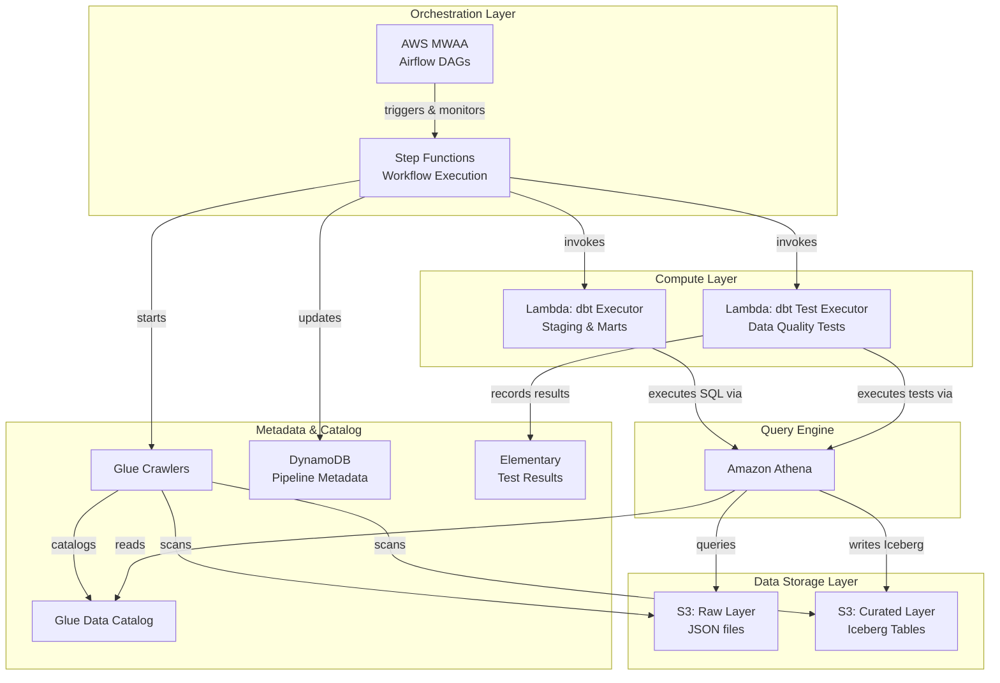

# AWS Data Lakehouse MVP

A modern data lakehouse implementation on AWS using serverless and managed services. This project demonstrates the lakehouse pattern with a two-tier orchestration model: AWS MWAA for high-level pipeline scheduling and Step Functions for granular workflow execution with Lambda-based dbt transformations.

## Architecture



## Data Flow

Data flows through two logical layers:

1. **Raw Layer** (`s3://bucket/raw/`) - Landing zone for ingested data in JSON format
2. **Curated Layer** (`s3://bucket/curated/`) - Business-ready Iceberg tables created by Lambda+Athena

### Pipeline Execution Sequence

1. MWAA triggers Step Functions state machine on schedule (daily at 6 AM UTC)
2. Step Functions records pipeline start in DynamoDB
3. Glue Crawler scans raw layer and updates catalog
4. **Lambda dbt Executor** runs staging models (views) via Athena
5. **Lambda dbt Executor** runs marts models (Iceberg tables) via Athena
6. Glue Crawler registers curated Iceberg tables
7. **Lambda dbt Test Executor** runs 23 data quality tests via Athena
8. Test results recorded to Elementary table for observability
9. Pipeline completion recorded in DynamoDB
10. MWAA monitors execution and provides alerting

## Prerequisites

- **AWS CLI** v2.x configured with appropriate credentials
- **Terraform** >= 1.0
- **Python** >= 3.8 (for local dbt development)

## Deployment

### 1. Initialize Terraform

```bash
cd terraform
terraform init
```

### 2. Review the Plan

```bash
terraform plan -var-file=environments/sandbox/terraform.tfvars
```

### 3. Apply Infrastructure

```bash
terraform apply -var-file=environments/sandbox/terraform.tfvars
```

This deploys:
- S3 buckets for data lake and Athena results
- Glue database and crawlers
- DynamoDB metadata table
- Lambda functions for dbt execution and testing
- Step Functions state machine
- MWAA environment
- Athena workgroup
- All required IAM roles and policies

## Post-Deployment Steps

### Upload DAGs to MWAA

```bash
# Get the DAGs bucket name from Terraform output
DAG_BUCKET=$(terraform output -raw dags_bucket_name)

# Sync DAGs to S3
aws s3 sync ../dags/ s3://${DAG_BUCKET}/dags/
```

### Upload Raw Data

```bash
# Upload sample data to raw layer
aws s3 cp data/raw_events.json s3://<data-lake-bucket>/raw/events/
aws s3 cp data/raw_users.json s3://<data-lake-bucket>/raw/users/
```

### Trigger Pipeline

The pipeline can be triggered:
1. **Via Airflow UI**: Trigger the `lakehouse_raw_to_curated` DAG
2. **Via Step Functions Console**: Start execution of the state machine
3. **Automatically**: Runs daily at 6 AM UTC

## Lambda Functions

### dbt Executor (`dbt_athena_executor.py`)
Executes dbt-style transformations via Athena:
- **Staging models**: Creates views over raw data with light transformations
- **Marts models**: Creates Iceberg tables with business logic

### dbt Test Executor (`dbt_test_executor.py`)
Runs data quality tests via Athena:
- 23 schema tests (not_null, unique, accepted_values)
- Records results to Elementary table for observability
- Tests both staging views and marts tables

## Directory Structure

```
.
├── README.md                 # This file
├── terraform/                # Infrastructure as Code
│   ├── main.tf              # Root module, provider config
│   ├── variables.tf         # Input variables
│   ├── outputs.tf           # Output values
│   ├── backend.tf           # Remote state configuration
│   ├── locals.tf            # Naming conventions, tags
│   ├── modules/
│   │   ├── storage/         # S3 buckets, lifecycle policies
│   │   ├── catalog/         # Glue database, crawlers
│   │   ├── metadata/        # DynamoDB table
│   │   ├── orchestration/   # MWAA environment
│   │   ├── workflow/        # Step Functions + Lambda functions
│   │   │   └── lambda/      # dbt executor & test executor
│   │   └── analytics/       # Athena workgroup
│   └── environments/
│       └── sandbox/         # Environment-specific tfvars
├── dags/                     # Airflow DAG definitions
│   └── lakehouse_pipeline.py # Triggers Step Functions
├── dbt_project/              # dbt transformation definitions (reference)
│   ├── models/
│   │   ├── staging/         # Staging model SQL
│   │   └── marts/           # Marts model SQL
│   └── macros/              # Reusable SQL macros
└── docs/                     # Documentation
    ├── runbooks.md          # Operational procedures
    └── best-practices.md    # Architecture best practices
```

## Key Components

| Component | Purpose |
|-----------|---------|
| **S3** | Data lake storage with raw/curated layers |
| **Glue Crawlers** | Automatic schema discovery and catalog updates |
| **Glue Catalog** | Centralized metadata store for all tables |
| **DynamoDB** | Pipeline execution metadata and lineage tracking |
| **Step Functions** | Workflow orchestration with retry/error handling |
| **Lambda (dbt Executor)** | Executes staging views and marts Iceberg tables via Athena |
| **Lambda (Test Executor)** | Runs 23 data quality tests and records to Elementary |
| **MWAA** | DAG scheduling, monitoring, and alerting |
| **Athena** | Serverless SQL queries and Iceberg table management |
| **Elementary** | Data observability - test results tracking |

## Data Models

### Staging Layer (Views)
- `stg_raw_events` - Cleaned events with parsed timestamps
- `stg_raw_users` - Cleaned users with standardized fields

### Marts Layer (Iceberg Tables)
- `fct_events` - Fact table with enriched event data
- `dim_users` - Dimension table with user attributes

## Data Quality Tests

23 tests run automatically after each pipeline execution:

| Model | Tests |
|-------|-------|
| `stg_raw_events` | not_null (4), unique (1) |
| `stg_raw_users` | not_null (4), unique (2) |
| `fct_events` | not_null (5), unique (1), accepted_values (1) |
| `dim_users` | not_null (5), unique (2) |

## Monitoring

- **Airflow UI**: DAG runs, task status, logs
- **Step Functions Console**: Execution history, state transitions
- **CloudWatch**: Lambda logs, Athena query metrics
- **Elementary Table**: Historical test results for trend analysis
- **DynamoDB**: Pipeline metadata and execution history
