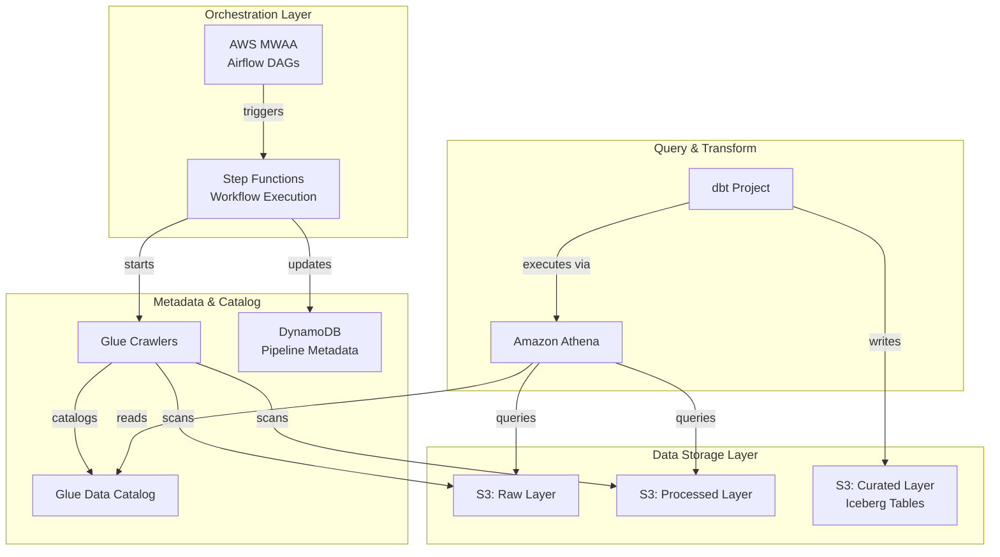

# AWS Data Lakehouse MVP

A modern data lakehouse implementation on AWS using serverless and managed services. This project demonstrates the lakehouse pattern with a two-tier orchestration model: AWS MWAA for high-level pipeline scheduling and Step Functions for granular workflow execution.

## Architecture



## Data Flow

Data flows through three logical layers:

1. **Raw Layer** (`s3://bucket/raw/`) - Landing zone for ingested data in original format
2. **Processed Layer** (`s3://bucket/processed/`) - Cleaned and validated data
3. **Curated Layer** (`s3://bucket/curated/`) - Business-ready Iceberg tables created by dbt

### Pipeline Execution Sequence

1. MWAA triggers Step Functions state machine on schedule
2. Step Functions records pipeline start in DynamoDB
3. Glue Crawler scans raw layer and updates catalog
4. dbt transformations execute via Athena
5. Iceberg tables written to curated layer
6. Glue Crawler registers curated tables
7. Pipeline completion recorded in DynamoDB

## Prerequisites

- **AWS CLI** v2.x configured with appropriate credentials
- **Terraform** >= 1.0
- **Python** >= 3.8 (for dbt and Airflow development)
- **dbt-core** with dbt-athena adapter

```bash
# Install dbt with Athena adapter
pip install dbt-core dbt-athena-community
```

## Deployment

### 1. Initialize Terraform

```bash
cd terraform
terraform init
```

### 2. Review the Plan

```bash
terraform plan -var-file=environments/sandbox/terraform.tfvars
```

### 3. Apply Infrastructure

```bash
terraform apply -var-file=environments/sandbox/terraform.tfvars
```

## Post-Deployment Steps

### Upload DAGs to MWAA

```bash
# Get the DAGs bucket name from Terraform output
DAG_BUCKET=$(terraform output -raw dags_bucket_name)

# Sync DAGs to S3
aws s3 sync ../dags/ s3://${DAG_BUCKET}/dags/
```

### Configure dbt Profile

1. Copy the example profile:
   ```bash
   cp dbt_project/profiles.yml.example ~/.dbt/profiles.yml
   ```

2. Update with your environment values:
   ```yaml
   lakehouse:
     target: sandbox
     outputs:
       sandbox:
         type: athena
         s3_staging_dir: s3://<athena-results-bucket>/results/
         region_name: us-east-1
         database: <glue-database-name>
         work_group: <athena-workgroup-name>
   ```

3. Test the connection:
   ```bash
   cd dbt_project
   dbt debug
   ```

### Run dbt Models

```bash
cd dbt_project
dbt deps      # Install packages
dbt compile   # Validate models
dbt run       # Execute transformations
dbt test      # Run data quality tests
```

## Directory Structure

```
.
├── README.md                 # This file
├── terraform/                # Infrastructure as Code
│   ├── main.tf              # Root module, provider config
│   ├── variables.tf         # Input variables
│   ├── outputs.tf           # Output values
│   ├── backend.tf           # Remote state configuration
│   ├── locals.tf            # Naming conventions, tags
│   ├── modules/
│   │   ├── storage/         # S3 buckets, lifecycle policies
│   │   ├── catalog/         # Glue database, crawlers
│   │   ├── metadata/        # DynamoDB table
│   │   ├── orchestration/   # MWAA environment
│   │   ├── workflow/        # Step Functions
│   │   └── analytics/       # Athena workgroup
│   └── environments/
│       └── sandbox/         # Environment-specific tfvars
├── dags/                     # Airflow DAG definitions
│   └── lakehouse_pipeline.py
└── dbt_project/              # dbt transformation project
    ├── dbt_project.yml
    ├── profiles.yml.example
    ├── packages.yml
    ├── models/
    │   ├── staging/         # Raw data transformation
    │   └── marts/           # Business-ready Iceberg tables
    └── macros/              # Reusable SQL macros
```

## Key Components

| Component | Purpose |
|-----------|---------|
| **S3** | Data lake storage with raw/processed/curated layers |
| **Glue Crawlers** | Automatic schema discovery and catalog updates |
| **Glue Catalog** | Centralized metadata store for all tables |
| **DynamoDB** | Pipeline execution metadata and lineage tracking |
| **Step Functions** | Workflow orchestration with retry/error handling |
| **MWAA** | DAG scheduling and cross-pipeline dependencies |
| **Athena** | Serverless SQL queries on data lake |
| **dbt** | Data transformations creating Iceberg tables |
